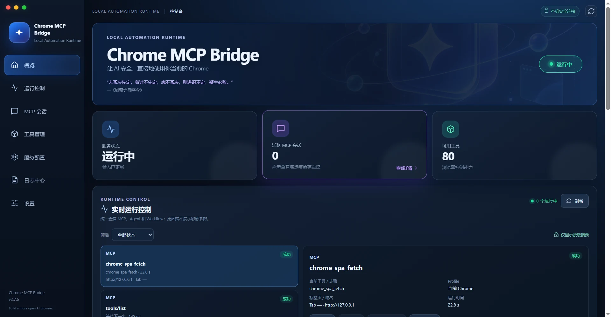

<p align="center">
  
</p>

<h1 align="center">Chrome MCP Server</h1>

<p align="center">
  <b>让 AI 直接操控你的 Chrome 浏览器</b><br />
  基于 Model Context Protocol，向 AI 助手开放 80 个浏览器能力<br />
  <b>新版 MCP：极低延迟、快速响应，本机请求响应可达 50ms 以内</b>
</p>

<p align="center">
  <a href="https://opensource.org/licenses/MIT"></a>
  <a href="https://www.typescriptlang.org/"></a>
  <a href="https://developer.chrome.com/docs/extensions/"></a>
  <a href="https://www.npmjs.com/package/@ethanwilkins/mcp-chrome-bridge-2026"></a>
  <a href="https://github.com/phoenixlucky/mcp-chrome-2026/releases"></a>
</p>

<p align="center">
  <b>
    <a href="README.md">🇨🇳 中文</a> ·
    <a href="README_en.md">🇬🇧 English</a>
  </b>
</p>

---

## 📢 v2.7.6 更新内容

> **页面采集与审查能力增强** — 更适合处理多页面内容、评论线程和长列表数据。
>
> - 🕸️ **递归页面采集** — `chrome_crawl_links` 支持同源限制、深度/节点上限、重试、字段提取和部分失败结果返回。
> - 💬 **评论与回复提取** — `chrome_extract_thread` 支持滚动加载、嵌套条目过滤、字段映射和条件停止。
> - 📊 **长列表采集增强** — 虚拟列表、分页提取和多标签页采集支持独立状态、进度快照与诊断信息。
> - 🧭 **审查工具增强** — 页面审查摘要和分段展开流程支持更细的停止条件与可控点击次数。
> - 🖥️ **桌面助手与运行时改进** — 改进附件处理、运行时注册和桌面端交互稳定性。
> - 🔧 所有发布包版本统一为 v2.7.6

> 查看 [完整更新日志](docs/CHANGELOG.md) 了解所有版本变更。

---

## 🖼️ 界面预览

<p align="center">
  <table style="border-collapse: collapse; width: 100%; max-width: 960px; margin: 0 auto;">
    <tr>
      <td align="center" style="padding: 8px 12px;"><b>Popup 弹窗</b></td>
      <td align="center" style="padding: 8px 12px;"><b>Builder 工作流编辑器</b></td>
    </tr>
    <tr>
      <td align="center" style="padding: 6px 12px;">
        
      </td>
      <td align="center" style="padding: 6px 12px;">
        
      </td>
    </tr>
    <tr>
      <td align="center" style="padding: 6px 12px; font-size: 0.9em; color: #6e7781;">猫娘毛玻璃主题，<br/>MCP 工具一览</td>
      <td align="center" style="padding: 6px 12px; font-size: 0.9em; color: #6e7781;">可视化拖拽搭建，<br/>录制回放工作流</td>
    </tr>
    <tr>
      <td align="center" style="padding: 8px 12px;"><b>Quick Panel 快捷操作</b></td>
      <td align="center" style="padding: 8px 12px;"><b>Smart Assistant 智能助手</b></td>
    </tr>
    <tr>
      <td align="center" style="padding: 6px 12px;">
        
      </td>
      <td align="center" style="padding: 6px 12px;">
        
      </td>
    </tr>
    <tr>
      <td align="center" style="padding: 6px 12px; font-size: 0.9em; color: #6e7781;">页面内快捷工具，<br/>快速选取与操作</td>
      <td align="center" style="padding: 6px 12px; font-size: 0.9em; color: #6e7781;">侧边栏对话，<br/>Claude / Codex / DeepSeek</td>
    </tr>
  </table>
</p>

## 🖥️ Windows 桌面客户端

`chrome-mcp-desktop-2.7.6-win-x64.exe` 是随项目发布的 Windows 便携版桌面管理器（Tauri 2 + Vue）。它内置桥接运行时，双击即可启动或复用本机的 Chrome MCP 服务，不需要单独安装 Node.js；Chrome 扩展仍需按上面的步骤先安装并连接。



### 下载与使用

1. 从 [v2.7.6 Release][release-v2.7.6] 下载 [`chrome-mcp-desktop-2.7.6-win-x64.exe`][desktop-v2.7.6]，将文件放到可写目录后直接双击运行。
2. 客户端会自动启动或复用 `http://127.0.0.1:12306` 上的本机桥接服务；如果状态显示“等待连接”，请确认 Chrome 扩展已加载并点击扩展中的连接按钮。
3. 在控制台中可查看服务状态、Chrome 扩展连接、Native Host 连接、MCP 会话、可用工具、运行中的任务、服务入口和错误诊断；点击“刷新状态”或“健康检查”可重新探测。
4. 关闭窗口会将客户端最小化到系统托盘。托盘菜单可以重新显示客户端、立即健康检查，或选择“退出客户端（停止服务）”彻底退出并停止由客户端拥有的服务。

桌面客户端使用以下 MCP 入口，客户端配置方式与其他安装方式相同：

| 入口                      | 地址或配置                                               |
| ------------------------- | -------------------------------------------------------- |
| Streamable HTTP（兼容版） | `http://127.0.0.1:12306/mcp`                             |
| Streamable HTTP（无会话） | `http://127.0.0.1:12306/mcp-new`                         |
| SSE（旧版）               | `http://127.0.0.1:12306/sse`                             |
| STDIO                     | 使用独立的 `chrome-mcp-bridge-2.7.6-win-x64.exe --stdio` |

> 注意：`chrome-mcp-desktop-2.7.6-win-x64.exe` 是图形化管理客户端，不要把它直接作为 STDIO MCP `command`。需要 STDIO 时，请使用桥接运行时 EXE 并传入 `--stdio`；需要管理服务时再打开桌面客户端。

[desktop-v2.7.6]: https://github.com/phoenixlucky/mcp-chrome-2026/releases/download/v2.7.6/chrome-mcp-desktop-2.7.6-win-x64.exe

## ✨ 核心特性

|                                                                     |                                                                    |                                                              |                                                                   |
| ------------------------------------------------------------------- | ------------------------------------------------------------------ | ------------------------------------------------------------ | ----------------------------------------------------------------- |
| **🤖 AI 原生控制**<br/>Claude / Cursor / VS Code<br/>直接操控浏览器 | **🔐 零配置即用**<br/>复用现有 Chrome<br/>登录态 / Cookie 即刻继承 | **🛡️ 纯本地运行**<br/>数据不出环境<br/>隐私安全有保障        | **🚄 新版 MCP**<br/>极低延迟、快速响应<br/>本机响应可达 50ms 以内 |
| **🧠 语义搜索**<br/>向量数据库 + 本地嵌入<br/>跨标签页内容发现      | **⚡ SIMD 加速**<br/>WASM 优化引擎<br/>向量运算 4-8× 更快          | **📊 80 工具**<br/>导航 / 截图 / 表单<br/>书签 / 历史 / 网络 | **🔄 跨标签页操作**<br/>多标签 / 多窗口<br/>无缝协同管理          |

---

## ⚔️ 与 Playwright 对比

| 维度           | Playwright MCP              | Chrome 扩展 MCP（本项目）                    |
| -------------- | --------------------------- | -------------------------------------------- |
| **浏览器进程** | 需启动独立实例 + 下载二进制 | **直接使用你现有的 Chrome**                  |
| **登录态**     | 每个站点重新登录            | **自动继承**，即开即用                       |
| **用户环境**   | 干净配置文件，无扩展无设置  | **完整用户配置**，一切保留                   |
| **API 能力**   | 限于 Playwright API         | **完整 Chrome API**（标签页/书签/历史/下载） |
| **启动速度**   | 需初始化新浏览器（数秒）    | **即刻激活**（< 1s）                         |
| **通信延迟**   | 50–200ms                    | **更低延迟**，进程内通信                     |

---

## 🚀 5 分钟上手

> 第一次使用？按下面的 1 → 4 做完即可。Windows 用户推荐使用桌面客户端；macOS / Linux 用户或习惯命令行的用户可以使用 Node.js 方式。

### 1️⃣ 安装 Chrome 扩展

1. 从 [v2.7.6 Release][release-v2.7.6] 下载 [Chrome 插件包][extension-v2.7.6]。
2. 解压下载的 `.zip` 文件。
3. 在 Chrome 地址栏打开 `chrome://extensions/`，开启右上角的 **开发者模式**。
4. 点击 **加载已解压的扩展程序**，选择刚才解压出来的文件夹。
5. 点击浏览器工具栏中的 Chrome MCP 图标，再点击 **连接**。

看到扩展显示已连接后，保持 Chrome 开着，继续下一步。

[release-v2.7.6]: https://github.com/phoenixlucky/mcp-chrome-2026/releases/tag/v2.7.6
[extension-v2.7.6]: https://github.com/phoenixlucky/mcp-chrome-2026/releases/download/v2.7.6/chrome-mcp-server-2.7.6-chrome.zip

### 2️⃣ 启动本地服务（二选一）

#### Windows：使用桌面客户端（推荐）

1. 下载 [`chrome-mcp-desktop-2.7.6-win-x64.exe`][desktop-v2.7.6]。
2. 双击 EXE 文件，客户端会自动启动或复用本机服务。
3. 打开客户端后，看到“服务状态：运行中”和“Chrome 扩展：已连接”即可。

桌面客户端是便携版，不需要安装 Node.js。它还可以查看 MCP 会话、工具调用、运行任务和错误诊断。关闭窗口不会停止服务，而是缩到系统托盘。

#### macOS / Linux 或命令行：使用 Node.js

先安装 Node.js 24 或更高版本，然后在终端执行：

```bash
npm install -g --allow-scripts=@ethanwilkins/mcp-chrome-bridge-2026 @ethanwilkins/mcp-chrome-bridge-2026
mcp-chrome-bridge start
```

npm 安装完成后会自动注册 Chrome 需要的 Native Host。服务启动后默认监听 `http://127.0.0.1:12306`。

> Windows 用户如果已经使用桌面客户端，就不要再重复执行 Node.js 安装和启动命令；两种方式选一种即可。

### 3️⃣ 把 MCP 服务添加到 AI 客户端

在 Claude、Cherry Studio、Cursor 等 AI 客户端的 MCP 设置中，新增一个服务器，选择 **Streamable HTTP**（有些客户端写作 `streamableHttp`），填写：

```text
地址：http://127.0.0.1:12306/mcp
```

如果客户端需要 JSON 配置，可以直接使用：

```json
{
  "mcpServers": {
    "chrome-mcp-server": {
      "type": "streamableHttp",
      "url": "http://127.0.0.1:12306/mcp"
    }
  }
}
```

如果客户端只支持 STDIO，请使用桥接运行时，不要使用图形化桌面客户端：

```json
{
  "mcpServers": {
    "chrome-mcp-bridge": {
      "command": "D:\\path\\chrome-mcp-bridge-2.7.6-win-x64.exe",
      "args": ["--stdio"]
    }
  }
}
```

### 4️⃣ 检查是否成功

1. 回到 AI 客户端，刷新 MCP 服务器或重新打开会话。
2. 看到 Chrome MCP 的工具列表（例如 `chrome_get_tab_url`、`chrome_screenshot`）就说明连接成功。
3. 发送一句简单的测试指令：

   > 请读取我当前 Chrome 标签页的标题和网址。

如果桌面客户端显示“等待连接”，先检查 Chrome 扩展是否已点击 **连接**；也可以在浏览器打开 `http://127.0.0.1:12306/status?probe=1` 查看状态。

### 进阶配置（第一次使用可以先跳过）

#### 更快的无会话接口

支持新版 MCP 2026-07-28 的客户端可以使用：

```json
{
  "mcpServers": {
    "chrome-mcp-new": {
      "type": "streamableHttp",
      "url": "http://127.0.0.1:12306/mcp-new"
    }
  }
}
```

该接口按请求工作，不保存会话，轻量请求响应可达 **50ms 以内**。完整的请求头、`_meta` 结构和调试示例见 [`/mcp-new` 接口说明](docs/MCP_NEW_zh.md)。如果客户端不能自定义 `Origin` 等新版协议字段，请继续使用上面的 `/mcp`。

#### 旧版 SSE 客户端

需要旧 SSE 协议的客户端使用：

- SSE 地址：`http://127.0.0.1:12306/sse`
- 消息地址：`http://127.0.0.1:12306/messages?sessionId=...`

#### STDIO 的其他启动方式

安装 npm 包后，也可以直接运行：

```bash
mcp-chrome-bridge stdio
```

`mcp-chrome-bridge --stdio` 会优先连接 `/mcp-new`，失败时回退到 `/mcp`；如果本机服务尚未启动，会自动启动并复用本地服务。如需强制服务由外部进程启动，可设置 `CHROME_MCP_AUTOSTART_SERVER=0`。旧入口 `mcp-chrome-stdio` 仍然兼容。

#### Windows 开发者：打包便携版 EXE

在仓库根目录双击 `package-desktop-windows.bat`，按提示选择 Desktop client。脚本会检查版本一致性，并生成：

```text
releases/chrome-mcp-desktop-<版本>-win-x64.exe
```

如果只需要桥接运行时，也可以使用 `package-windows.bat` 生成 `chrome-mcp-bridge-<版本>-win-x64.exe`。

#### 保护 HTTP MCP 端点

默认仅监听本机且不需要 API Key。需要保护 HTTP / SSE 端点时，在启动服务前设置：

```powershell
$env:CHROME_MCP_API_KEY = "replace-with-a-long-random-key"
mcp-chrome-bridge start
```

客户端发送 `Authorization: Bearer <key>`（或 `x-api-key`）即可；STDIO 代理会读取同一个环境变量并自动转发 Bearer token。没有 `Origin` 的 HTTP MCP 请求必须携带有效 API Key。

#### 并发和工具权限

服务默认最多同时执行 8 个工具调用，最多排队 64 个。可按机器性能调整：

```powershell
$env:CHROME_MCP_MAX_CONCURRENT_TOOLS = "8"
$env:CHROME_MCP_MAX_QUEUED_TOOLS = "64"
mcp-chrome-bridge start
```

也可以限制客户端能看到的工具，并要求高风险工具审批：

```powershell
$env:CHROME_MCP_ALLOWED_TOOLS = "chrome_read_page,chrome_get_tab_url,flow.*"
$env:CHROME_MCP_REQUIRE_APPROVAL = "true"
$env:CHROME_MCP_APPROVED_TOOLS = "flow.checkout"
```

`CHROME_MCP_REQUIRE_APPROVAL=true` 时，JavaScript 执行、写入/发布、文件上传、Profile 管理和 `flow.*` 等高风险工具必须同时出现在审批清单中。未配置这些变量时保持现有兼容行为。

更多高级环境变量（扩展 ID、Origin 白名单、请求体大小和 Artifact 限制）见 [故障排除指南](docs/TROUBLESHOOTING_zh.md)。

---

## 🧩 隔离浏览器 Profile

默认情况下，所有浏览器工具继续直接操作你当前正在使用的 Chrome。需要账号、Cookie 或缓存隔离时，先调用 `chrome_profile`：

```json
{ "action": "create", "name": "工作账号", "profileId": "work" }
```

然后给普通浏览器工具增加 `profileId`；Profile 未启动时会自动拉起独立 Chrome：

```json
{ "profileId": "work", "url": "https://example.com" }
```

也可以用 `chrome_profile` 的 `list`、`status`、`diagnostics`、`launch`、`stop`、`delete` 管理 Profile。`delete` 只删除配置，不会自动删除 `userDataDir`，避免误删登录态；如需让独立 Chrome加载本地扩展，可设置 `CHROME_MCP_EXTENSION_PATH`。

点击、输入、滚动、导航等动作默认使用统一的 `balanced` 节奏；需要时可传 `actionPolicy: "fast"` 或 `actionPolicy: "human"`。

需要把多个浏览器动作组成一次任务时，可调用 `chrome_batch`，最多顺序执行 50 个工具调用；通过 `profileId` 可将整组任务固定到同一个隔离 Profile。现有工作流 v3 已支持持久化运行队列和 cron/interval 定时触发。

### 安全升级

```bash
mcp-chrome-bridge upgrade 2.3.0 --dry-run
mcp-chrome-bridge upgrade 2.3.0
```

升级只接受精确版本，会校验 npm SHA-512 完整性；安装后的关键文件校验失败会自动尝试回滚到原版本。

### ✅ 验证状态

- Native Server：5 个 Jest suite、18 个测试（含权限策略与 HTTP 鉴权）由 CI 执行并收集覆盖率
- Chrome Extension：58 个 Vitest 文件、567 个测试由 CI 执行
- Native / Extension / Shared TypeScript 检查通过
- 版本一致性：`pnpm check:versions`
- 工具文档：`pnpm check:tool-docs`

### 真实 Chrome Smoke Test

该测试不使用 jsdom、fake IndexedDB 或 mock Chrome API。请先安装并加载扩展、让 Native Host 连接成功并启动 HTTP 服务，再运行：

```powershell
pnpm test:chrome-smoke
```

测试会检查 Native Host 的扩展连接和浏览器探针，建立真实 MCP session，发现工具，并通过 `chrome_get_tab_url` 访问当前 Chrome 标签页。可用 `CHROME_MCP_SMOKE_URL`、`CHROME_MCP_SMOKE_TIMEOUT_MS` 和 `CHROME_MCP_API_KEY` 覆盖连接配置。

---

## 🛠️ 工具一览

| 分类              | 数量 | 覆盖能力                                                                        |
| ----------------- | :--: | ------------------------------------------------------------------------------- |
| 🖥️ **浏览器管理** |  12  | 窗口/标签页列表、新建标签页、导航、切换、关闭、当前 URL、滚动、Profile/批量任务 |
| 📷 **截图与 PDF** |  3   | 元素级、全页面、自定义视口、GIF 录制、页面打印为 PDF                            |
| 🌐 **网络监控**   |  6   | 指定标签抓包与响应等待、精确资源拦截、自定义 HTTP、下载处理                     |
| 📝 **内容分析**   |  7   | 语义搜索、HTML / 文本提取、交互元素检测、控制台日志、SPA 内容                   |
| 🖱️ **交互操作**   |  11  | 点击、悬停、表单填充、键盘输入、元素信息、计算机操作、对话框、上传              |
| 📑 **数据管理**   |  11  | 历史搜索、书签增删查、Cookie 管理、页面 local/sessionStorage、Userscript        |
| 📡 **采集提取**   |  16  | 作用域/Shadow DOM/iframe、受控分页、隔离任务状态、诊断快照、代理轮换            |
| ⚡ **性能诊断**   |  3   | Trace 录制 / 停止 / 洞察分析                                                    |

📖 完整 API 参考：[中文](docs/TOOLS_zh.md) · [English](docs/TOOLS.md)

---

## 📚 使用指南

| 指南                                          | 说明                                      |
| --------------------------------------------- | ----------------------------------------- |
| 🤖 [智能助手指南](docs/SMART_ASSISTANT_zh.md) | Claude / Codex / DeepSeek 会话与 API 配置 |
| ⚡ [快捷工具指南](docs/QUICK_TOOLS_zh.md)     | 页面 Quick Panel 和插件弹窗 MCP 工具目录  |

---

## 🎬 使用场景

| 场景                               | 操作                                    |
| ---------------------------------- | --------------------------------------- |
| 📄 **AI 总结 + Excalidraw 可视化** | 总结页面内容并画图                      |
| 🖼️ **图片分析 + Excalidraw 复现**  | 分析图片内容并重建                      |
| 🎨 **样式注入与网页修改**          | 修改页面样式去广告                      |
| 📡 **网络请求捕获分析**            | 查找 API 端点与响应结构                 |
| 📊 **浏览历史分析**                | 分析近一个月浏览记录                    |
| 💬 **网页对话**                    | 翻译并总结当前页面                      |
| 📸 **页面与元素截图**              | 截取首页 / 捕获图标                     |
| 🔖 **书签管理**                    | 将当前页添加到书签                      |
| 🗑️ **批量关闭标签页**              | 关闭匹配关键词的标签页                  |
| 🤖 **智能助手对话**                | 侧边栏与 Claude / Codex / DeepSeek 对话 |
| 🔄 **工作流录制与回放**            | 录制重复操作并一键回放                  |
| 🧩 **工作流可视化编排**            | Builder 拖拽搭建自动化流程              |
| 📊 **页面数据采集**                | 从列表 / 虚拟滚动页提取结构化数据       |
| ⚡ **页面性能分析**                | 录制 Trace 并分析加载瓶颈               |
| 🎥 **操作录制为 GIF**              | 将页面交互录制成 GIF                    |

---

## 🗺️ 路线图

### ✅ 已实现

- **80 MCP 工具** — 浏览器全能力覆盖，包含公开的 `chrome_userscript`、页面采集和线程提取工具
- **Streamable HTTP（兼容版 / 尝鲜版）+ SSE + STDIO 全部保留**
- **智能助手** — Claude / Codex / DeepSeek
- **语义搜索** — 向量数据库 + 本地嵌入
- **SIMD 加速** — WASM 引擎 4-8× 更快
- **工作流录制与回放** — v3 统一架构（旧架构已完全迁移）
- **可视化编辑器** — 拖拽搭建工作流
- **Native Messaging 自动注册**
- **跨平台安装体验** — macOS / Linux 一键脚本
- **多 Profile 任务隔离** — 独立 Cookie、缓存、历史与登录态
- **登录态持久化** — 关闭后可恢复独立 Profile
- **统一 ActionPolicy** — 稳定点击 / 输入 / 滚动节奏
- **多会话并行** — 多 Profile 使用独立 MCP/CDP 通道
- **Profile 诊断** — 汇总 Profile、CDP、MCP、代理与扩展状态
- **安全升级** — 精确版本、SHA-512 校验、失败回滚
- **批量与定时任务** — `chrome_batch`、工作流队列和 cron/interval 触发
- **Native Messaging 控制通道与并发治理** — 全局并发限制与全局队列限制（`CHROME_MCP_MAX_CONCURRENT_TOOLS=8` / `CHROME_MCP_MAX_QUEUED_TOOLS=64`）、同一 Tab 写操作串行、`chrome_batch` 不额外占用外层并发槽位、`/status` 的 `toolAdmission` 实时暴露占用与排队

### 🎯 规划中

- **认证与权限管理** — HTTP API Key、工具范围和高风险批准清单已支持；OAuth 仍在规划
- **实时监控仪表盘** — Web 面板查看调用、性能、错误
- **多版本 Chrome 实机矩阵** — 在不同 Chrome 版本 / Profile / 运行环境中做真实浏览器回归
- **产品边界扩展** — 托管浏览器与远程 CDP

#### 🧭 三层通道架构（规划中）

目标通道布局：Native Messaging 继续作为**安全控制通道**；大块二进制（截图、PDF、完整 HTML）不经过 Native Messaging，改走 Artifact 文件面；高频事件按需走 WebSocket。

```text
MCP Client
    │ stdio JSON-RPC
    ▼
mcp-chrome-bridge
    │ HTTP / MCP
    ▼
Native Service
    ├── 控制面：Native Messaging + JSON-RPC v2
    ├── 数据面：Artifact 文件 + localhost HTTP
    └── 事件面：localhost WebSocket（可选）
    ▼
Chrome Extension Background
    ├── chrome.tabs / scripting
    └── CDP
```

**核心原则**：Native Messaging 不传大块二进制；写操作不自动重试；同一 Tab 操作串行；所有请求具备超时、取消、追踪与最终状态；WebSocket、Go/Rust 重写只在性能数据证明需要时引入（Chrome Native Messaging 单条消息上限约 1 MB，不适合承载大截图、PDF 与完整 HTML）。

- **阶段一 · 协议 V2** — 统一 Native Service 与 Extension Background 协议：消息类型 `request` / `response` / `event` / `cancel` / `ping` / `pong` / `hello` / `capabilities`；协议版本协商、能力发现、JSON Schema 校验、requestId 去重、traceId 链路追踪、deadline 传播、AbortSignal 取消、统一错误码、单请求只响应一次。错误码：`INVALID_REQUEST` / `UNSUPPORTED_VERSION` / `DEADLINE_EXCEEDED` / `CANCELED` / `NATIVE_DISCONNECTED` / `QUEUE_FULL` / `BROWSER_ERROR` / `EXECUTION_UNKNOWN`
- **阶段二 · 连接与请求生命周期** — 统一状态机 `starting → connected → ready → degraded → stopped`；由一个重连管理器统一负责 Native Host 重连；断线时取消所有 active/pending 请求，HTTP 断开向下游传播取消；超时发送 cancel 而非仅返回错误；pending 请求最终必须进入完成 / 取消 / 失败。MV3 Service Worker 关键状态持久化到 `chrome.storage` / IndexedDB。副作用操作区分 `succeeded` / `failed-before-execution` / `execution-unknown`，断线后不自动重试
- **阶段三 · 并发、队列和隔离** — 在已完成机制之上继续：按浏览器实例 / Profile 隔离队列；读、写操作分离；写操作保持 Tab 内严格顺序；队列满返回 `QUEUE_FULL`；统计平均排队时长、拒绝次数、超时次数；读操作可选优先级但不打乱写顺序
- **阶段四 · Artifact 数据面** — 控制消息只返回元数据（`artifactId` / `contentType` / `size` / `sha256`）；小数据直接 JSON 返回，大文件分片传输（每片 256～512 KB，`artifactId + seq + eof + sha256`）；写入临时文件后原子改名；TTL 自动清理、容量上限、断线删除残留；对 Cookie / Token / Authorization 脱敏。第一版：Native Messaging 分片上传 + localhost HTTP 下载（改动最小）
- **阶段五 · localhost WebSocket 事件通道** — 仅当事件推送或高频数据成为瓶颈时启用；随机端口 + 一次性 Token 下发；适用于 Tab 状态变化、下载 / 长任务进度、网络事件、订阅与流式数据；只绑定 127.0.0.1、Origin 白名单、连接数 / 空闲 / 请求大小限制、禁止匿名访问敏感接口；Service Worker 中需周期性通信维持活跃
- **阶段六 · 安全和可观测性** — 精确校验扩展 ID、支持 `CHROME_MCP_ALLOWED_ORIGINS`、localhost 接口用 API Key / 一次性 Token、日志禁止输出 Cookie / Token / 完整页面、限制请求体与执行时间与 Artifact 容量、默认关闭调试接口；每请求 traceId 并记录 `stdio_wait` / `http_process` / `native_queue_wait` / `native_roundtrip` / `browser_execution` / `total` 分段耗时；`/status` 增加 `connectionState` / `pendingRequests` / `activeTools` / `queuedTools` / `reconnectCount` / `timeoutCount` / `cancelCount` / `queueRejectCount` / `lastError`；跨进程链路追踪（OpenTelemetry）暂缓
- **阶段七 · 统一传输实现** — 收敛 stdio 适配器公共逻辑（JSON-RPC 编解码、deadline、retry、错误映射、取消、Content-Length、`/mcp-new` 与 `/mcp` 兼容）；Native Messaging 只支持协议 V2，`/mcp-new` 默认，`/mcp` 仅保留兼容用途
- **阶段八 · 测试和发布** — 故障场景覆盖：Native Host 断线、响应丢失但操作成功、半包 / 粘包、Service Worker 休眠恢复、CDP 被 DevTools 占用、队列满取消、batch 达最大并发、Artifact 传输中断、重连连发请求、同一写操作重复请求。发布门槛：1000 次混合读写通过、30 分钟压测无内存持续增长、断线后 pending / controller / queue 归零、写操作无自动重放、单条 Native 输出低于安全阈值、大文件全走 Artifact、`/status` 准确、`/mcp` 兼容与 `/mcp-new` 主流程测试全过

阶段八门禁命令：

```powershell
pnpm run test:phase8
pnpm run check:phase8
$env:PHASE8_STRESS_MS = '1800000'; node --expose-gc scripts/phase8-gates.mjs
```

其中第一条运行 Native Service 回归测试，第二条构建并执行 1000 次混合读写及归零检查；30 分钟压力测试需显式执行。V1 不再实现，V1 输入由 `UNSUPPORTED_VERSION` 拒绝，V2 为唯一协议。

- **最终技术选择与路线** — 推荐 Node.js/TypeScript：JSON-RPC V2 + TypeBox 校验 + AbortController + Artifact 文件存储 + localhost HTTP；WebSocket 仅用于高频事件与流式；暂不引入 WebTransport / gRPC / 直接 9222 CDP。路线：先统一协议 → 再完善取消与断线恢复 → 再拆分 Artifact 数据面 → 再按指标引入 WebSocket → 最后考虑 Go/Rust Native Host；优先完成协议 V2、生命周期管理、Artifact 与故障测试

### 🆕 新增工具

| 工具                                    | 说明                                                                          |
| --------------------------------------- | ----------------------------------------------------------------------------- |
| `chrome_crawl_links`                    | 递归访问页面链接，支持深度/节点上限、同源限制、重试和字段提取                 |
| `chrome_extract_thread`                 | 从页面中提取评论或回复，支持滚动加载、嵌套过滤和条件停止                      |
| `chrome_create_tab`                     | 新建标签页 — 支持 url、windowId、激活/后台打开、是否固定                      |
| `chrome_hover`                          | 悬停元素 — 通过 CSS/XPath 选择器触发 hover，展开 dropdown / tooltip / submenu |
| `chrome_print_to_pdf`                   | 打印为 PDF — 调用 CDP Page.printToPDF，支持页面/自定义纸张尺寸                |
| `chrome_get_element_info`               | 元素信息查询 — 获取指定元素的 attributes、computed styles、bounding rect      |
| `chrome_storage_get` / `set` / `delete` | 存储管理 — 读写 localStorage / sessionStorage                                 |

PDF 工具默认返回 PDF 的 Base64 数据；传入 `savePdf: true` 可同时保存到 Chrome 下载目录。页面存储工具操作目标标签页的 `localStorage` 或 `sessionStorage`，非扩展自身存储。

---

## 💝 技术支持与赞助

项目完全开源免费。如果你觉得它有用，或需要技术支持 / 新功能建议，欢迎通过以下方式联系作者。

**赞助支持可解锁浏览器插件高级功能 🔓** —— 你的支持是持续开发的动力！

<p align="center">
  <table style="border-collapse: collapse; width: 100%; max-width: 960px; margin: 0 auto;">
    <tr>
      <td align="center" style="padding: 8px 12px;"><b>微信 · 交流与技术支持</b></td>
      <td align="center" style="padding: 8px 12px;"><b>支付宝 · 赞助支持</b></td>
      <td align="center" style="padding: 8px 12px;"><b>微信支付 · 赞助支持</b></td>
    </tr>
    <tr>
      <td align="center" style="padding: 6px 12px;">
        
      </td>
      <td align="center" style="padding: 6px 12px;">
        
      </td>
      <td align="center" style="padding: 6px 12px;">
        
      </td>
    </tr>
    <tr>
      <td align="center" style="padding: 6px 12px; font-size: 0.9em; color: #6e7781;">扫码添加好友，<br/>获取技术支持与交流</td>
      <td align="center" style="padding: 6px 12px; font-size: 0.9em; color: #6e7781;">扫码赞助，<br/>解锁插件高级功能</td>
      <td align="center" style="padding: 6px 12px; font-size: 0.9em; color: #6e7781;">扫码赞助，<br/>解锁插件高级功能</td>
    </tr>
  </table>
</p>

---

## 🤝 贡献

欢迎贡献！提交 PR 前请阅读 [CONTRIBUTING_zh.md](docs/CONTRIBUTING_zh.md)。

---

## 📄 许可证

MIT — 详见 [LICENSE](LICENSE) 文件。

---

## 📖 更多文档

| 文档                   | 链接                                                |
| ---------------------- | --------------------------------------------------- |
| 🏗️ 架构设计            | [ARCHITECTURE_zh.md](docs/ARCHITECTURE_zh.md)       |
| 🔧 工具 API 参考       | [TOOLS_zh.md](docs/TOOLS_zh.md)                     |
| 🤖 智能助手指南        | [SMART_ASSISTANT_zh.md](docs/SMART_ASSISTANT_zh.md) |
| ⚡ 快捷工具指南        | [QUICK_TOOLS_zh.md](docs/QUICK_TOOLS_zh.md)         |
| 🌐 `/mcp-new` 接口说明 | [MCP_NEW_zh.md](docs/MCP_NEW_zh.md)                 |
| 🔍 故障排除            | [TROUBLESHOOTING_zh.md](docs/TROUBLESHOOTING_zh.md) |
| 📋 更新日志            | [CHANGELOG.md](docs/CHANGELOG.md)                   |
