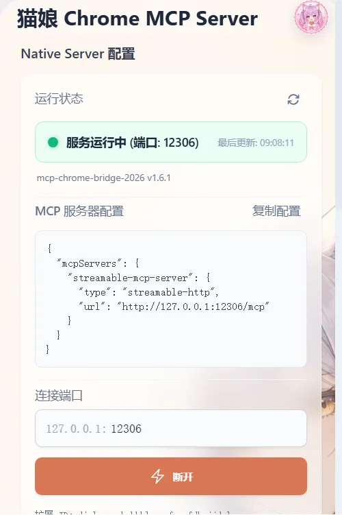
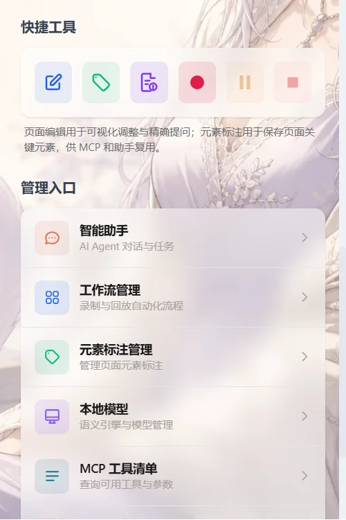
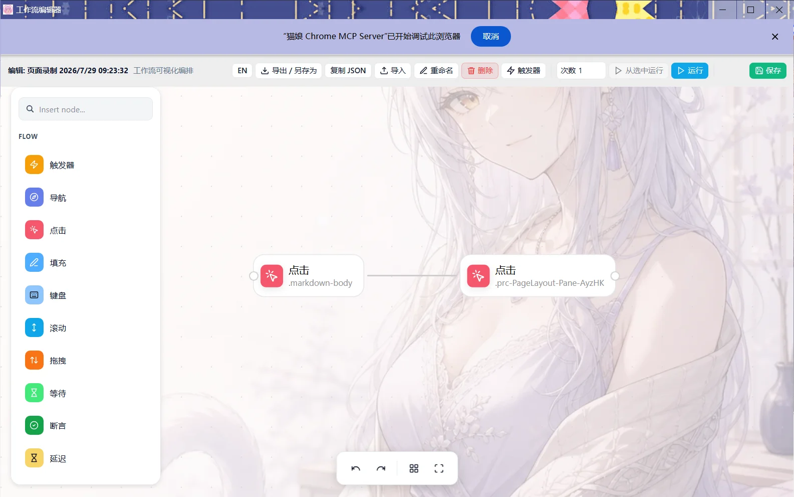
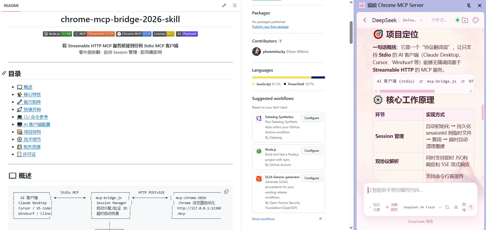

<p align="center">
  
</p>

<h1 align="center">Chrome MCP Server</h1>

<p align="center">
  <b>Bridge AI agents with your Chrome browser</b><br />
  A Model Context Protocol server that exposes 76 browser capabilities to AI assistants
</p>

<p align="center">
  <a href="https://opensource.org/licenses/MIT"></a>
  <a href="https://www.typescriptlang.org/"></a>
  <a href="https://developer.chrome.com/docs/extensions/"></a>
  <a href="https://www.npmjs.com/package/@ethanwilkins/mcp-chrome-bridge-2026"></a>
  <a href="https://github.com/phoenixlucky/mcp-chrome-2026/releases"></a>
</p>

<p align="center">
  <b>
    <a href="README.md">🇨🇳 中文</a> ·
    <a href="README_en.md">🇬🇧 English</a>
  </b>
</p>

---

## 📢 What's New in v2.6.7

> **Request observability, cancellation, and configurable timeouts** — Easier to diagnose and recover stuck MCP calls across all endpoints.
>
> - 🛰️ **All-entry request monitor** — The desktop client shows active `/mcp`, `/mcp-new`, `/sse`, and STDIO tools, request IDs, elapsed time, and client information.
> - ⏹️ **Cancel stuck requests** — Cancel a request from the desktop client by request ID and propagate cancellation through MCP, Native Messaging, and the Chrome extension.
> - 🔁 **Extension reconnect recovery** — Content-script calls retry once after waiting for the tab and reinjecting the content script when the channel is disconnected.
> - 📦 **Large-response fix** — Artifact responses are no longer misclassified as failures, eliminating `Error calling tool: undefined`.
> - ⏱️ **Configurable timeouts** — Page-message timeout defaults to 30 seconds and can be configured from 5 to 300 seconds; tool execution windows are also more tolerant.
> - 🛡️ **Complete error reporting** — Preserve status and details when the extension returns an unsuccessful response.
> - 🔧 All release packages bumped to v2.6.7

> See the [full changelog](docs/CHANGELOG.md) for all version changes.

---

## 🖼️ Screenshots

<p align="center">
  <table style="border-collapse: collapse; width: 100%; max-width: 960px; margin: 0 auto;">
    <tr>
      <td align="center" style="padding: 8px 12px;"><b>Popup Window</b></td>
      <td align="center" style="padding: 8px 12px;"><b>Builder Workflow Editor</b></td>
    </tr>
    <tr>
      <td align="center" style="padding: 6px 12px;">
        
      </td>
      <td align="center" style="padding: 6px 12px;">
        
      </td>
    </tr>
    <tr>
      <td align="center" style="padding: 6px 12px; font-size: 0.9em; color: #6e7781;">Catgirl frosted glass theme,<br/>MCP tools at a glance</td>
      <td align="center" style="padding: 6px 12px; font-size: 0.9em; color: #6e7781;">Drag-and-drop workflow builder,<br/>record & replay automation</td>
    </tr>
    <tr>
      <td align="center" style="padding: 8px 12px;"><b>Quick Panel</b></td>
      <td align="center" style="padding: 8px 12px;"><b>Smart Assistant</b></td>
    </tr>
    <tr>
      <td align="center" style="padding: 6px 12px;">
        
      </td>
      <td align="center" style="padding: 6px 12px;">
        
      </td>
    </tr>
    <tr>
      <td align="center" style="padding: 6px 12px; font-size: 0.9em; color: #6e7781;">In-page quick tools,<br/>element picker & actions</td>
      <td align="center" style="padding: 6px 12px; font-size: 0.9em; color: #6e7781;">Sidepanel chat,<br/>Claude / Codex / DeepSeek</td>
    </tr>
  </table>
</p>

## ✨ Features

|                                                                                           |                                                                               |                                                                                 |                                                                              |
| ----------------------------------------------------------------------------------------- | ----------------------------------------------------------------------------- | ------------------------------------------------------------------------------- | ---------------------------------------------------------------------------- |
| **🤖 AI-Native Control**<br/>Claude / Cursor / VS Code<br/>operates your browser directly | **🔐 Zero Setup**<br/>Reuses your Chrome<br/>sessions & cookies instantly     | **🛡️ Fully Local**<br/>All processing on-device<br/>no data leaves your machine | **🚄 Streamable HTTP**<br/>Real-time streaming<br/>Modern MCP transport      |
| **🧠 Semantic Search**<br/>Vector DB + local embeddings<br/>cross-tab content discovery   | **⚡ SIMD Acceleration**<br/>WASM-optimized engine<br/>4-8× faster vector ops | **📊 76 Tools**<br/>Navigation / forms<br/>bookmarks / history / network        | **🔄 Cross-Tab Ops**<br/>Multi-tab & multi-window<br/>seamless orchestration |

---

## ⚔️ vs Playwright-based Alternatives

| Dimension            | Playwright MCP                                | Chrome Extension MCP (This Project)                       |
| -------------------- | --------------------------------------------- | --------------------------------------------------------- |
| **Browser Process**  | Launches separate instance + downloads binary | **Uses your existing Chrome**                             |
| **Login Sessions**   | Re-authenticate every site                    | **Automatically inherited**                               |
| **User Environment** | Clean profile — no extensions, no settings    | **Full user profile** — everything intact                 |
| **API Surface**      | Limited to Playwright API                     | **Full Chrome API** (tabs, bookmarks, history, downloads) |
| **Startup Time**     | Initialize new browser (seconds)              | **Instant** (< 1s)                                        |
| **Latency**          | 50–200ms                                      | **Lower** — in-process communication                      |

---

## 🚀 5-Minute Setup

### 1️⃣ Install the Chrome Extension

Download `chrome-mcp-server-*.zip` from the [Releases page](https://github.com/phoenixlucky/mcp-chrome-2026/releases).

Open `chrome://extensions/` → enable **Developer mode** → drag & drop the `.zip` to install.

### 2️⃣ Install the Native Host

```bash
# npm (recommended — auto-registers)
npm install -g --allow-scripts=@ethanwilkins/mcp-chrome-bridge-2026 @ethanwilkins/mcp-chrome-bridge-2026

# pnpm
pnpm install -g @ethanwilkins/mcp-chrome-bridge-2026
```

> `postinstall` auto-registers Native Messaging Host. Manual: `mcp-chrome-bridge register`

> The npm command above allows the bridge to run the scripts required for this install (`better-sqlite3` ships N-API prebuilt binaries since v13 and no longer needs install scripts). To allow the bridge automatically for future installs, run:
>
> ```bash
> npm config set allow-scripts="@ethanwilkins/mcp-chrome-bridge-2026" --location=user
> ```

### 3️⃣ Start the Service

```bash
# One-click start (recommended)
mcp-chrome-bridge start

# Or via the startup script after cloning
# Windows
start-server.bat

# macOS / Linux
bash start-server.sh
```

The service listens on `http://127.0.0.1:12306/mcp` and also keeps the new `/mcp-new`, legacy SSE, and STDIO entry points.

### Optional: protect HTTP MCP endpoints

Local no-auth access remains the default. To protect HTTP and SSE transports, set the key before starting:

```powershell
$env:CHROME_MCP_API_KEY = "replace-with-a-long-random-key"
mcp-chrome-bridge start
```

Clients may send `Authorization: Bearer <key>` (or `x-api-key`). The STDIO proxy reads the same environment variable and forwards the Bearer token automatically.

### Tool scopes and high-risk approval

Restrict which tools an MCP client can discover and call with comma-separated names or simple trailing-prefix patterns such as `flow.*`:

```powershell
$env:CHROME_MCP_ALLOWED_TOOLS = "chrome_read_page,chrome_get_tab_url,flow.*"
$env:CHROME_MCP_REQUIRE_APPROVAL = "true"
$env:CHROME_MCP_APPROVED_TOOLS = "flow.checkout"
```

With `CHROME_MCP_REQUIRE_APPROVAL=true`, high-risk tools such as `chrome_javascript`, `chrome_userscript`, write/publish/file-upload tools, Profile management, and `flow.*` must also appear in `CHROME_MCP_APPROVED_TOOLS`. Tools outside the scope or approval list are hidden from `tools/list` and rejected at call time. Leaving these variables unset preserves the existing compatibility behavior.

HTTP MCP requests without an `Origin` must carry a valid API key; requests with an Origin are limited to localhost or browser-extension origins.

### 4️⃣ Configure Your MCP Client

**Streamable HTTP (Compatibility endpoint, recommended for existing clients)**

```json
{
  "mcpServers": {
    "chrome-mcp-server": {
      "type": "streamableHttp",
      "url": "http://127.0.0.1:12306/mcp"
    }
  }
}
```

**Streamable HTTP (Early Access)**

The MCP 2026-07-28 stateless endpoint is available at `http://127.0.0.1:12306/mcp-new`:

```json
{
  "mcpServers": {
    "chrome-mcp-new": {
      "type": "streamableHttp",
      "url": "http://127.0.0.1:12306/mcp-new"
    }
  }
}
```

**SSE (Legacy MCP)**

- SSE endpoint: `http://127.0.0.1:12306/sse`
- Message endpoint: `http://127.0.0.1:12306/messages?sessionId=...`

**STDIO (No extra bridge)**

```json
{
  "mcpServers": {
    "chrome-mcp-stdio": {
      "command": "mcp-chrome-stdio",
      "env": {
        "MCP_SERVER_URL": "http://127.0.0.1:12306/mcp"
      }
    }
  }
}
```

---

## 🧩 Isolated Browser Profiles

By default, browser tools continue to control the Chrome you are currently using. For account, cookie, or cache isolation, call `chrome_profile` first:

```json
{ "action": "create", "name": "Work account", "profileId": "work" }
```

Then add `profileId` to a normal browser tool; an isolated Chrome instance starts automatically when needed:

```json
{ "profileId": "work", "url": "https://example.com" }
```

Use `chrome_profile` with `list`, `status`, `diagnostics`, `launch`, `stop`, or `delete` to manage profiles. `delete` removes only the profile configuration and keeps `userDataDir`, preventing accidental loss of login state. Set `CHROME_MCP_EXTENSION_PATH` when the isolated Chrome must load a locally built extension.

Click, input, scroll, and navigation actions use a unified `balanced` pace by default; pass `actionPolicy: "fast"` or `actionPolicy: "human"` when needed.

Use `chrome_batch` to run up to 50 browser calls sequentially as one task; pass `profileId` to pin the batch to one isolated Profile. Workflow v3 already provides persistent queues plus cron/interval triggers.

### Safe upgrades

```bash
mcp-chrome-bridge upgrade 2.3.0 --dry-run
mcp-chrome-bridge upgrade 2.3.0
```

Upgrades require an exact version and verify npm SHA-512 integrity. If post-install validation fails, the command attempts to roll back to the previous version.

### ✅ Verification

- Native Server: 5 suites, 18 tests (including permission policy and HTTP auth)
- Chrome Extension: 58 test files, 567 tests
- Native / Extension / Shared TypeScript checks passed
- Version consistency: `pnpm check:versions`
- Tool docs: `pnpm check:tool-docs`

### Real Chrome smoke test

This test does not use jsdom, fake IndexedDB, or mocked Chrome APIs. Install/load the extension, wait for the Native Host connection, and start the HTTP server first:

```powershell
pnpm test:chrome-smoke
```

It checks the Native Host extension connection and browser probe, creates a real MCP session, discovers the catalog, and calls `chrome_get_tab_url` against the current Chrome tab. Use `CHROME_MCP_SMOKE_URL`, `CHROME_MCP_SMOKE_TIMEOUT_MS`, and `CHROME_MCP_API_KEY` to override the connection settings.

---

## 🛠️ Tools at a Glance

| Category                  | Count | Coverage                                                                                          |
| ------------------------- | :---: | ------------------------------------------------------------------------------------------------- |
| 🖥️ **Browser Management** |  12   | Window/tab listing, new tabs, navigation, switch, close, current URL, scroll, Profile/batch tasks |
| 📷 **Screenshots & PDF**  |   3   | Element-level, full-page, custom viewport, GIF recording, page-to-PDF printing                    |
| 🌐 **Network Monitoring** |   6   | Request capture & response wait, resource blocking, custom HTTP, download handling                |
| 📝 **Content Analysis**   |   7   | Semantic search, HTML/text extraction, interactive elements, console capture, SPA                 |
| 🖱️ **Interaction**        |  11   | Click, hover, fill forms, keyboard, element info, computer ops, dialogs, file upload              |
| 📑 **Data Management**    |  11   | History search, bookmark CRUD, Cookie management, page local/sessionStorage, userscripts          |
| 📡 **Scraping**           |  16   | Scoped/Shadow DOM/iframe, pagination, isolated task state, diagnostics, proxy rotate              |
| ⚡ **Performance**        |   3   | Trace start / stop / insight analysis                                                             |

📖 Full API reference: [中文](docs/TOOLS_zh.md) · [English](docs/TOOLS.md)

---

## 📚 Usage Guides

| Guide                                               | Description                                            |
| --------------------------------------------------- | ------------------------------------------------------ |
| 🤖 [Smart Assistant Guide](docs/SMART_ASSISTANT.md) | Claude / Codex / DeepSeek sessions & API configuration |
| ⚡ [Quick Tools Guide](docs/QUICK_TOOLS.md)         | Page Quick Panel & popup MCP tool catalog              |

---

## 🎬 Use Cases

| Scenario                           | Prompt                                                                                           |
| ---------------------------------- | ------------------------------------------------------------------------------------------------ |
| 📄 **AI Summary + Excalidraw Viz** | [excalidraw-prompt](prompt/excalidraw-prompt.md)                                                 |
| 🖼️ **Image Analysis + Excalidraw** | [excalidraw-prompt](prompt/excalidraw-prompt.md) \| [content-analize](prompt/content-analize.md) |
| 🎨 **Style Injection & Web Mod**   | [modify-web-prompt](prompt/modify-web.md)                                                        |
| 📡 **Network Request Analysis**    | —                                                                                                |
| 📊 **Browsing History Analysis**   | —                                                                                                |
| 💬 **Web Page Conversation**       | —                                                                                                |
| 📸 **Page & Element Screenshots**  | —                                                                                                |
| 🔖 **Bookmark Management**         | —                                                                                                |
| 🗑️ **Batch Tab Closure**           | —                                                                                                |
| 🤖 **Smart Assistant Chat**        | —                                                                                                |
| 🔄 **Workflow Record & Replay**    | —                                                                                                |
| 🧩 **Visual Workflow Builder**     | —                                                                                                |
| 📊 **Page Data Extraction**        | —                                                                                                |
| ⚡ **Page Performance Analysis**   | —                                                                                                |
| 🎥 **Record Actions as GIF**       | —                                                                                                |

---

## 🗺️ Roadmap

### ✅ Done

- **76 MCP Tools** — Full browser API coverage, including public `chrome_userscript`
- **Streamable HTTP (compatibility / early access) + SSE + STDIO** — All transports retained
- **Smart Assistant** — Claude / Codex / DeepSeek
- **Semantic Search** — Vector DB + local embeddings
- **SIMD Acceleration** — WASM engine 4-8× faster
- **Workflow Recording & Replay** — v3 unified architecture (legacy architecture fully migrated)
- **Visual Editor** — Drag-and-drop workflow builder
- **Native Messaging Auto-registration**
- **Cross-platform Setup** — macOS / Linux one-click scripts
- **Multi-Profile Isolation** — Separate cookies, cache, history and login state
- **Persistent Sessions** — Restore isolated profiles after browser close
- **Unified ActionPolicy** — Stable click / input / scroll pacing
- **Parallel Sessions** — Separate MCP/CDP channels per profile
- **Profile Diagnostics** — Profile, CDP, MCP, proxy and extension state
- **Safe Upgrades** — Exact versions, SHA-512 verification and rollback
- **Batch and Scheduled Tasks** — `chrome_batch`, workflow queues and cron/interval triggers

### 🎯 Planned

- **Auth & Permission** — HTTP API key, tool scopes, and high-risk approval lists are supported; OAuth remains planned
- **Monitoring Dashboard** — Web panel for calls, perf, errors
- **Multi-version Chrome Matrix** — Run real-browser regression tests across Chrome versions / profiles / environments
- **Expanded Product Scope** — Hosted browsers and remote CDP

### 🆕 New Tools

| Tool                                    | Description                                                                                    |
| --------------------------------------- | ---------------------------------------------------------------------------------------------- |
| `chrome_create_tab`                     | Create new tab — supports url, windowId, active/background, pinned                             |
| `chrome_hover`                          | Hover element — trigger hover state via CSS/XPath selector for dropdowns / tooltips / submenus |
| `chrome_print_to_pdf`                   | Print to PDF — uses CDP Page.printToPDF, supports page/custom paper sizes                      |
| `chrome_get_element_info`               | Element info query — get attributes, computed styles, bounding rect for a selector             |
| `chrome_storage_get` / `set` / `delete` | Storage management — read/write localStorage / sessionStorage                                  |

The PDF tool returns Base64 PDF data by default; pass `savePdf: true` to also save it to Chrome downloads. Storage tools operate on the target page's `localStorage` or `sessionStorage`, not extension storage.

---

## 🤝 Contributing

Contributions welcome! Please read [CONTRIBUTING.md](docs/CONTRIBUTING.md) before submitting a PR.

---

## 📄 License

MIT — see [LICENSE](LICENSE) for details.

---

## 📖 Documentation

| Document                 | Link                                          |
| ------------------------ | --------------------------------------------- |
| 🏗️ Architecture          | [ARCHITECTURE.md](docs/ARCHITECTURE.md)       |
| 🔧 Tool API Reference    | [TOOLS.md](docs/TOOLS.md)                     |
| 🤖 Smart Assistant Guide | [SMART_ASSISTANT.md](docs/SMART_ASSISTANT.md) |
| ⚡ Quick Tools Guide     | [QUICK_TOOLS.md](docs/QUICK_TOOLS.md)         |
| 🔍 Troubleshooting       | [TROUBLESHOOTING.md](docs/TROUBLESHOOTING.md) |
| 📋 Changelog             | [CHANGELOG.md](docs/CHANGELOG.md)             |
