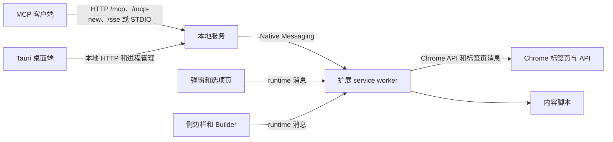
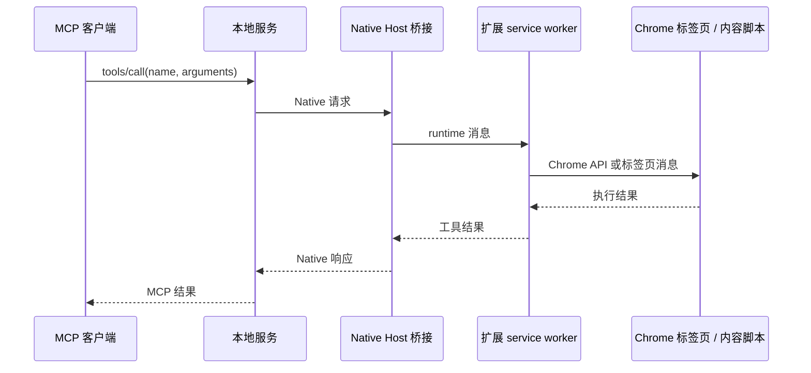

# 项目架构

Chrome MCP Bridge 通过本地服务和 Manifest V3 扩展，把 MCP 客户端连接到用户现有的 Chrome 配置。扩展负责浏览器访问；本地 Node.js 进程提供 MCP 传输，并通过 Chrome Native Messaging 转发浏览器工具调用。

## 运行组件

### 本地服务（`app/native-server/`）

- `src/server/index.ts` 创建 Fastify 服务，并提供健康状态、诊断和 MCP 路由。
- `src/mcp/` 实现协议传输、工具注册、权限过滤和请求排队。
- `src/native-messaging-host.ts` 通过 Chrome Native Messaging 连接扩展。
- `src/agent/` 包含可选的本地助手、不同引擎、会话服务和 SQLite 持久化。

### Chrome 扩展（`app/chrome-extension/`）

- `entrypoints/background/` 是 Manifest V3 service worker，注册 runtime 监听器，并将工具调用路由到浏览器 API、内容脚本或页面辅助脚本。
- `entrypoints/`、`inject-scripts/` 和 `shared/` 实现页面交互与复用 UI 行为。
- `entrypoints/popup/`、`options/`、`sidepanel/` 和 `builder/` 提供扩展界面；需要特权浏览器 API 的操作通过 service worker 消息完成。
- `entrypoints/offscreen/` 提供需要文档环境的任务，包括 GIF 编码和本地语义推理。

### 共享契约（`packages/shared/`）

`src/tools.ts` 与 `src/tools-en.ts` 定义浏览器工具的 schema 和描述。本地服务与扩展共用这些契约，确保 MCP 工具名称和输入结构一致。

### 桌面端（`app/desktop-client/`）

Tauri + Vue 客户端负责管理本地服务生命周期，并展示服务健康状态和诊断信息。它不替代 Chrome 扩展；Chrome 仍需安装并连接扩展。

## 浏览器工具调用流程

`/mcp` 为客户端维护会话；`/mcp-new` 无状态；`/sse` 保留旧传输。STDIO 客户端使用桥接可执行文件，该程序运行相同的本地服务和 MCP 协议实现。

## 可选的本地语义搜索

语义搜索是可选的扩展功能。模型文件保存在浏览器 Cache API，向量和索引数据保存在 IndexedDB。service worker 启动时会检查模型缓存，只有缓存已有模型或收到语义操作消息时才初始化推理流程。推理在 offscreen 文档创建的 worker 中运行；模型文件按需下载。扩展包包含该推理 worker 所需的运行时资源。

## 构建与验证

- `pnpm build` 构建共享包、本地服务、扩展和桌面前端。
- `pnpm run build:release` 构建 Rust/WASM SIMD 包，并在工作区构建前复制生成的 worker 文件。
- `.github/workflows/ci.yml` 执行类型检查、lint、单元/集成测试、构建和本地服务请求准入检查。真实 Chrome smoke test 需要在已准备好的 Windows runner 上手动触发。

## 源码索引

| 职责                    | 目录或文件                                           |
| ----------------------- | ---------------------------------------------------- |
| MCP HTTP/SSE 路由和状态 | `app/native-server/src/server/`                      |
| MCP 工具注册和权限      | `app/native-server/src/mcp/`                         |
| Native Messaging 桥接   | `app/native-server/src/native-messaging-host.ts`     |
| 扩展工具实现            | `app/chrome-extension/entrypoints/background/tools/` |
| 页面注入辅助脚本        | `app/chrome-extension/inject-scripts/`               |
| 共享工具 schema         | `packages/shared/src/tools.ts`                       |
| 桌面端进程集成          | `app/desktop-client/src-tauri/src/`                  |
